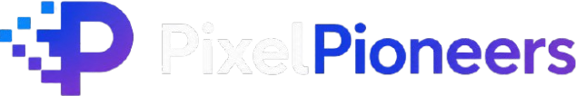
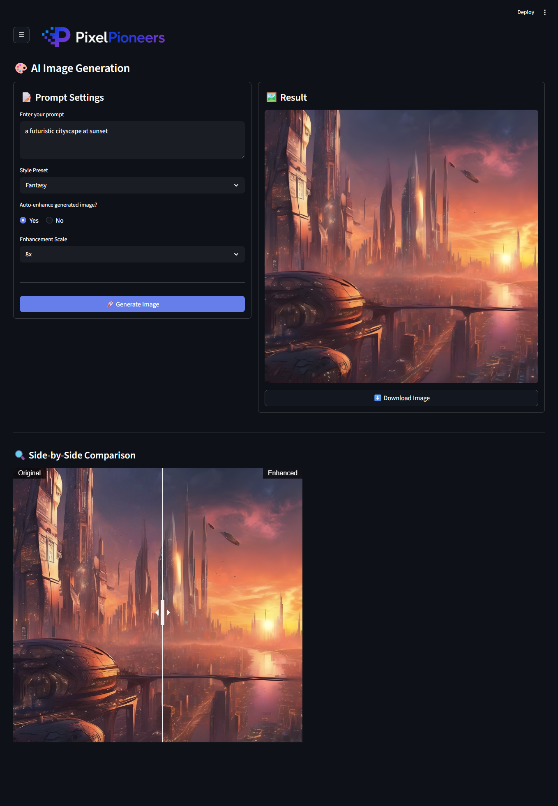
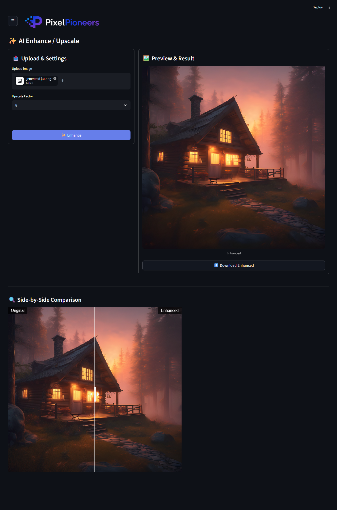
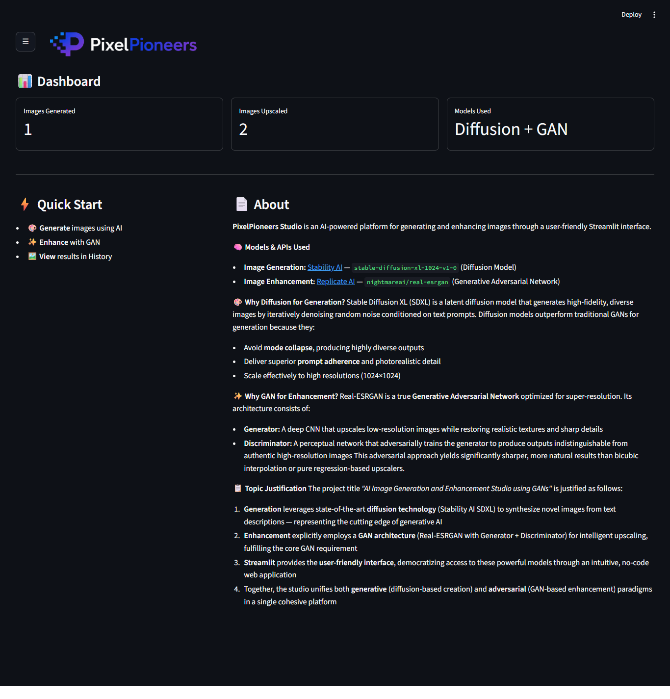

<div align="center">

  <!-- Banner -->
  

  <h1>🎨 PixelPioneers Studio</h1>
  <p><strong>AI Image Generation & Enhancement Studio using Diffusion & GANs</strong></p>

  <p>
    
    
    
    
    
  </p>

  <p>
    <a href="#features">Features</a> •
    <a href="#tech-stack">Tech Stack</a> •
    <a href="#prerequisites">Prerequisites</a> •
    <a href="#installation--setup">Installation</a> •
    <a href="#usage">Usage</a> •
    <a href="#project-structure">Structure</a> •
    <a href="#team">Team</a>
  </p>

</div>

---

## 📖 Description

**PixelPioneers Studio** is an AI-powered web application built with [Streamlit](https://streamlit.io/) that enables users to **generate stunning images from text prompts** using state-of-the-art diffusion models, and **enhance/upscale images** using Generative Adversarial Networks (GANs). The platform unifies both generative (diffusion-based creation) and adversarial (GAN-based enhancement) paradigms in a single, intuitive, no-code web interface.

Whether you're an artist, designer, developer, or AI enthusiast, PixelPioneers Studio democratizes access to powerful generative AI models through a clean, responsive, and user-friendly dashboard.

---

## ✨ Features

| Feature                        | Description                                                                                            |
| ------------------------------ | ------------------------------------------------------------------------------------------------------ |
| 🎨 **AI Image Generation**     | Generate high-fidelity 1024×1024 images from text prompts using **Stability AI's Stable Diffusion XL** |
| ✨ **AI Image Enhancement**    | Upscale images 2×, 4×, or 8× using **Real-ESRGAN (GAN)** via Replicate AI                              |
| 🖼️ **Side-by-Side Comparison** | Compare original vs. enhanced images with an interactive slider                                        |
| 🎭 **Style Presets**           | Choose from Cinematic, Anime, Fantasy, Cyberpunk, or define a Custom style                             |
| ⚡ **Auto-Enhance**            | Optionally auto-enhance generated images immediately after creation                                    |
| 📊 **Dashboard**               | Track metrics: Images Generated, Images Upscaled, Models Used                                          |
| 🖼️ **History Gallery**         | View, browse, and download all previously generated/enhanced images                                    |
| 👥 **Crew Page**               | Meet the team behind the project                                                                       |
| 📥 **Download Support**        | One-click download for any generated or enhanced image                                                 |
| 🌙 **Dark Theme UI**           | Sleek, modern dark-mode interface optimized for creative workflows                                     |

---

## 🖼️ Screenshots

### 🎨 Image Generation
<p align="center">
  
</p>

### ✨ Image Enhancement
<p align="center">
  
</p>

### 🖼️ Side-by-Side Comparison
<p align="center">
  
</p>

### 📊 Dashboard
<p align="center">
  
</p>

---

## 🛠️ Tech Stack

### Core Framework

- **[Streamlit](https://streamlit.io/)** — Python-based web framework for building data apps
- **[Python](https://www.python.org/)** 3.10+

### AI Models & APIs

| Purpose           | Model / API                                                           | Type                            |
| ----------------- | --------------------------------------------------------------------- | ------------------------------- |
| Image Generation  | [Stability AI](https://stability.ai/) `stable-diffusion-xl-1024-v1-0` | Latent Diffusion Model          |
| Image Enhancement | [Replicate AI](https://replicate.com/) `nightmareai/real-esrgan`      | GAN (Generator + Discriminator) |

### Python Libraries

```
streamlit==1.56.0          # Web application framework
requests==2.31.0           # HTTP requests for API calls
python-dotenv==1.0.1       # Environment variable management
Pillow==10.3.0             # Image processing
streamlit-image-comparison==0.0.4  # Interactive image comparison slider
numpy==1.26.4              # Numerical operations
replicate==0.32.0          # Replicate AI Python client
```

---

## 📋 Prerequisites

Before you begin, ensure you have the following installed and configured:

1. **Python 3.10 or higher**

   ```bash
   python --version
   ```

2. **pip** (Python package installer)

   ```bash
   pip --version
   ```

3. **Git** (for cloning the repository)

   ```bash
   git --version
   ```

4. **API Keys** (required for the app to function):
   - **[Stability AI API Key](https://platform.stability.ai/)** — for image generation
   - **[Replicate AI API Token](https://replicate.com/account/api-tokens)** — for image enhancement

---

## 🚀 Installation & Setup

### Step 1: Clone the Repository

```bash
git clone https://github.com/arijeetdas/pixelpioneers-studio.git
cd pixelpioneers-studio
```

### Step 2: Create a Virtual Environment

It is **highly recommended** to use a virtual environment to isolate project dependencies.

**On Windows:**

```bash
python -m venv genai_env
genai_env\Scripts\activate
```

**On macOS/Linux:**

```bash
python3 -m venv genai_env
source genai_env/bin/activate
```

### Step 3: Install Dependencies

```bash
pip install -r requirements.txt
```

### Step 4: Configure Environment Variables

Create a `.env` file in the **root directory** of the project:

```bash
touch .env
```

Add your API keys to the `.env` file:

```env
# ============================================
# PixelPioneers Studio — API Configuration
# ============================================

# Stability AI API Key (for image generation)
# Get yours at: https://platform.stability.ai/
STABILITY_API_KEY=your_stability_ai_api_key_here

# Replicate AI API Token (for image enhancement)
# Get yours at: https://replicate.com/account/api-tokens
REPLICATE_API_TOKEN=your_replicate_api_token_here
```

> ⚠️ **Important:** Never commit your `.env` file to version control. It contains sensitive API keys.

### Step 5: Verify Assets

Ensure the `assets/` directory is present with the following structure:

```
assets/
├── banner/
│   └── banner.png
├── favicon/
│   ├── favicon.ico
│   ├── favicon-16x16.png
│   ├── favicon-32x32.png
│   ├── apple-touch-icon.png
│   ├── android-chrome-192x192.png
│   ├── android-chrome-512x512.png
│   └── site.webmanifest
└── profile/                 # Use your team member names
    ├── member1.jpg
    ├── member2.jpg
    ├── member3.jpg
    ├── member4.jpg
    └── member5.jpg
```

---

## ▶️ Usage

### Run the Application

With your virtual environment activated, run:

```bash
streamlit run app.py
```

The application will automatically open in your default web browser at:

```
http://localhost:8501
```

### Navigation Guide

Once the app is running, use the **☰ hamburger menu** in the top-left to navigate between sections:

| Section                    | What You Can Do                                                   |
| -------------------------- | ----------------------------------------------------------------- |
| 📊 **Dashboard**           | View usage metrics and read about the AI models & architecture    |
| 🎨 **AI Image Generation** | Enter a text prompt, select a style preset, and generate images   |
| ✨ **AI Image Enhance**    | Upload an image and upscale it 2×, 4×, or 8× using GAN            |
| 🖼️ **History**             | Browse and download all your previously generated/enhanced images |
| 👥 **Crew**                | Meet the talented team behind PixelPioneers Studio                |

### How to Generate an Image

1. Go to **🎨 AI Image Generation**
2. Enter a descriptive prompt (e.g., _"a futuristic cityscape at sunset"_)
3. Select a **Style Preset** (Cinematic, Anime, Fantasy, Cyberpunk, Custom, or None)
4. Choose whether to **Auto-Enhance** the generated image
5. Click **🚀 Generate Image**
6. View, compare, and download your creation!

### How to Enhance an Image

1. Go to **✨ AI Image Enhance**
2. **Upload** an image (PNG, JPG, or JPEG)
3. Select an **Upscale Factor** (2×, 4×, or 8×)
4. Click **✨ Enhance**
5. Compare the original and enhanced versions side-by-side!

---

## 📁 Project Structure

```
📦 pixelpioneers-studio/
│
├── 📄 app.py                          # Main Streamlit application (entry point)
├── 📄 requirements.txt                # Python dependencies
├── 📄 README.md                       # Project documentation (this file)
├── 📄 .env                            # Environment variables(API keys) — create manually
│
├── 📁 .streamlit/
│   └── 📄 config.toml                 # Streamlit UI theme configuration (dark mode)
│
├── 📁 assets/                         # Static assets (images, icons, profiles)
│   ├── 📁 banner/
│   │   └── 🖼️ banner.png              # App banner/logo
│   ├── 📁 favicon/
│   │   ├── 🖼️ favicon.ico             # Browser tab icon
│   │   ├── 🖼️ favicon-16x16.png
│   │   ├── 🖼️ favicon-32x32.png
│   │   ├── 🖼️ apple-touch-icon.png
│   │   ├── 🖼️ android-chrome-192x192.png
│   │   ├── 🖼️ android-chrome-512x512.png
│   │   └── 📄 site.webmanifest
│   └── 📁 profile/                      # Use your team member name as file names
│       ├── 🖼️ member1.jpg               # Team member photo
│       ├── 🖼️ member2.jpg
│       ├── 🖼️ member3.jpg
│       ├── 🖼️ member4.jpg
│       └── 🖼️ member5.jpg
│
└── 📁 genai_env/         # Python virtual environment(auto-generated, ignored via .gitignore)
    ├── 📁 Lib/
    ├── 📁 Scripts/
    └── 📁 Include/
```

---

## 🔑 Environment Variables

The application requires the following environment variables to be set in a `.env` file:

| Variable              | Description                                    | Required | Source                                                                       |
| --------------------- | ---------------------------------------------- | -------- | ---------------------------------------------------------------------------- |
| `STABILITY_API_KEY`   | API key for Stability AI (image generation)    | ✅ Yes   | [platform.stability.ai](https://platform.stability.ai/)                      |
| `REPLICATE_API_TOKEN` | API token for Replicate AI (image enhancement) | ✅ Yes   | [replicate.com/account/api-tokens](https://replicate.com/account/api-tokens) |

### Example `.env` File

```env
STABILITY_API_KEY=your-stability-key-here
REPLICATE_API_TOKEN=your-replicate-token-here
```

---

## 🧠 AI Architecture Deep Dive

### 🎨 Why Diffusion for Generation?

**Stable Diffusion XL (SDXL)** is a latent diffusion model that generates high-fidelity, diverse images by iteratively denoising random noise conditioned on text prompts. Diffusion models outperform traditional GANs for generation because they:

- ✅ Avoid **mode collapse**, producing highly diverse outputs
- ✅ Deliver superior **prompt adherence** and photorealistic detail
- ✅ Scale effectively to high resolutions (1024×1024)

### ✨ Why GAN for Enhancement?

**Real-ESRGAN** is a true **Generative Adversarial Network** optimized for super-resolution. Its architecture consists of:

- **Generator:** A deep CNN that upscales low-resolution images while restoring realistic textures and sharp details
- **Discriminator:** A perceptual network that adversarially trains the generator to produce outputs indistinguishable from authentic high-resolution images

This adversarial approach yields significantly sharper, more natural results than bicubic interpolation or pure regression-based upscalers.

---

## 🎭 Available Style Presets

| Preset      | Description                                       |
| ----------- | ------------------------------------------------- |
| `None`      | No additional styling — pure prompt output        |
| `Cinematic` | Cinematic lighting, ultra realistic, 4K, dramatic |
| `Anime`     | Anime style, vibrant colors                       |
| `Fantasy`   | Fantasy art, magical atmosphere                   |
| `Cyberpunk` | Cyberpunk style, neon lights                      |
| `Custom`    | Define your own custom style description          |

---

## 🖥️ Streamlit Configuration

The app uses a custom dark theme defined in `.streamlit/config.toml`:

```toml
[theme]
base = "dark"
primaryColor = "#667eea"
backgroundColor = "#0e1117"
secondaryBackgroundColor = "#1a1d24"
textColor = "#fafafa"
font = "sans serif"
```

---

## 🧪 Development

### Running in Development Mode

```bash
# Ensure virtual environment is activated
streamlit run app.py
```

### Enabling Debug Mode

```bash
streamlit run app.py --logger.level=debug
```

### Updating Dependencies

If you add new packages, update `requirements.txt`:

```bash
pip freeze > requirements.txt
```

---

## 🐛 Troubleshooting

| Issue                           | Solution                                                                                                  |
| ------------------------------- | --------------------------------------------------------------------------------------------------------- |
| `ModuleNotFoundError`           | Ensure virtual environment is activated and dependencies are installed: `pip install -r requirements.txt` |
| `STABILITY_API_KEY not found`   | Check that `.env` file exists in the root directory and contains the key                                  |
| `REPLICATE_API_TOKEN not found` | Verify `.env` file has the correct token                                                                  |
| `Image generation fails`        | Verify your Stability AI API key is valid and has available credits                                       |
| `Enhancement fails`             | Verify your Replicate AI token is valid and the model is accessible                                       |
| `Assets not loading`            | Ensure the `assets/` folder is in the same directory as `app.py`                                          |
| `Port 8501 already in use`      | Run on a different port: `streamlit run app.py --server.port 8502`                                        |

---

## 👥 Team

Meet the brilliant minds behind **PixelPioneers Studio**:

| Name             | Role                          |
| ---------------- | ----------------------------- |
| **Arijeet Das**  | Project Lead                  |
| **Arijit Bera**  | AI Integration Engineer       |
| **Arigna Roy**   | Frontend Integration Engineer |
| **Ardhendu Pal** | Deployment & Backend Engineer |
| **Aisha Das**    | Frontend UI Engineer          |

---

## 🤝 Contributing

Contributions are welcome! If you'd like to improve PixelPioneers Studio:

1. Fork the repository
2. Create a feature branch (`git checkout -b feature/amazing-feature`)
3. Commit your changes (`git commit -m 'Add amazing feature'`)
4. Push to the branch (`git push origin feature/amazing-feature`)
5. Open a Pull Request

---

## 📄 License

This project is licensed under the **MIT License**. See the `LICENSE` file for details.

## 🙏 Acknowledgements

- [Stability AI](https://stability.ai/) for the powerful Stable Diffusion XL model
- [Replicate AI](https://replicate.com/) for hosting Real-ESRGAN and providing seamless API access
- [Streamlit](https://streamlit.io/) for making Python web apps incredibly simple and beautiful

---

<div align="center">

  <p><strong>⭐ Star this repo if you found it helpful!</strong></p>
  <p>Made with ❤️ by the PixelPioneers Team</p>

</div>
